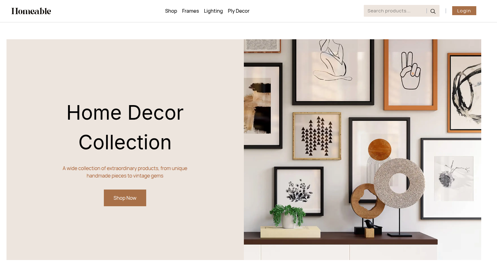
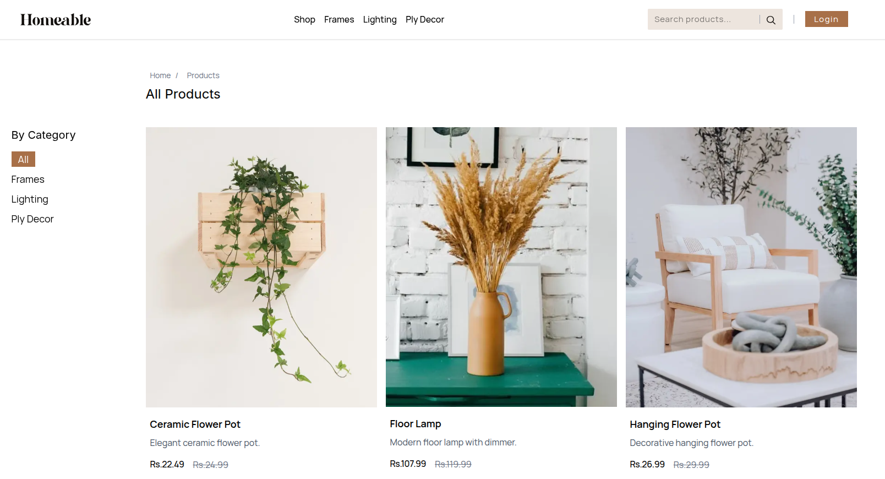
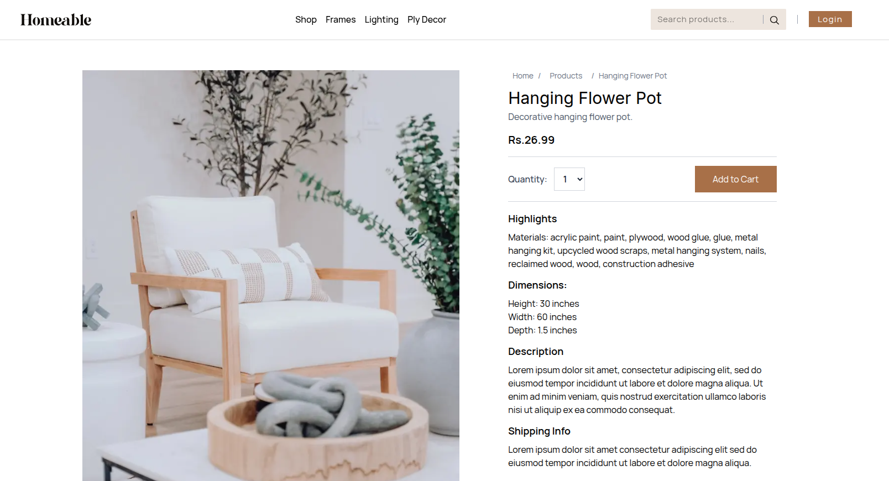
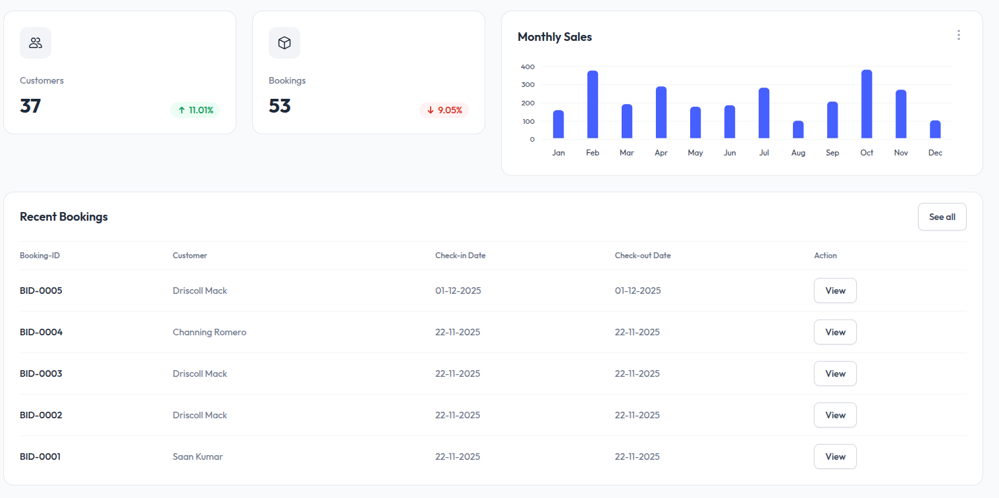
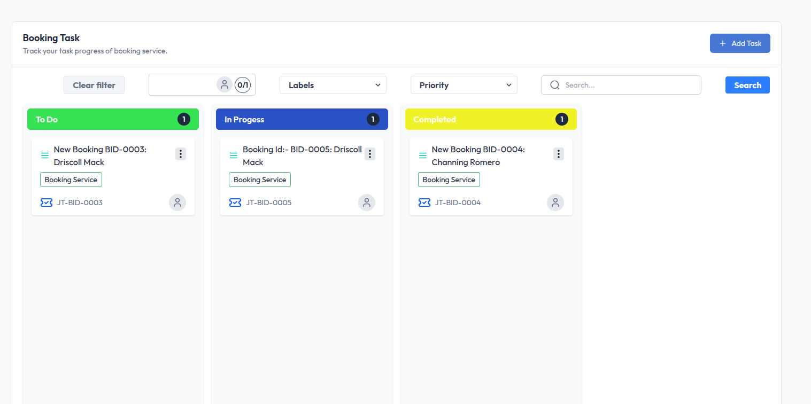
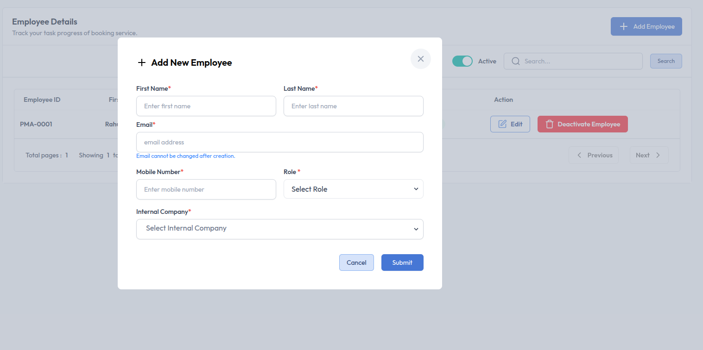

# 👋 Hi, I'm Rahul Prasad

**Full Stack Developer** | Kathmandu, Nepal

I’m a passionate developer with over **5 years of experience** building and scaling production-grade SaaS and government systems.
I specialize in modern web technologies, cloud infrastructure, and end-to-end ownership of production systems—from design to deployment.
My background combines deep technical execution with formal financial education, making me well-suited for a SaaS or finance-driven engineering environment.

---

## 🚀 Skills

● Languages: TypeScript, JavaScript, SQL  
● Frontend: React, Next.js, Vue.js, React Native  
● Backend: ExpressJS, NestJS, GraphQL, PostgreSQL, MySQL, MongoDB, Redis, RabbitMQ, Elasticsearch  
● Cloud & DevOps: AWS (EC2, S3, Lambda, RDS), Docker, Nginx, GitHub Actions, CI/CD Pipelines  
● Monitoring & Testing: Jest, Prometheus, Grafana,Jira

---

## 💼 Work Experience

### **Full Stack Developer** @ Aus Nepal IT Solution

- 🏗️ Construction Management System : Designed and implemented complex multi-table transactional workflows (14+ tables) with idempotency controls, ensuring ACID compliance and preventing duplicate processing in concurrent scenarios.
- Built a secure authentication and authorization layer using JWT with rotating access and refresh tokens, leveraging a Redis singleton pattern for centralized token storage and Redis-based caching of auth endpoints.
- Implemented a Purchase Order (PO) module with dynamic form rendering on the frontend (Next.js, Tailwind CSS) and an event-driven backend where PDF generation and email notifications are processed asynchronously using Redis Bull queues, with generated assets stored in AWS S3.

### **Full Stack Developer** @ CliffByte Pvt Ltd

- Developed secure, form-heavy government and KYC systems using React, ChakraUI, Node.js, and GraphQL.
- Built a multi-tenant SaaS frontend in React/Tailwind/ReactQuery/TypeScript, integrated with a PHP backend.

### **Full Stack Developer** @ Edalio Pvt Ltd

- **Video Streaming Platform (OTT):** Designed scalable video upload/streaming using AWS S3, Kafka, and HLS. (React/Redux/ExpressJS/Postgress)
- **E-commerce Platform:** Led frontend development with Vue.js and React (on Admin Side), built backend delivery management with Node.js , ExpressJS and MongoDB.

---

## 🛠️ Projects

### Admincentrik — Full-Stack E-Commerce Application

A production-ready, full-stack e-commerce platform built with **Next.js 15** and **TypeScript**, featuring server-side rendering for SEO, Google OAuth authentication, a PostgreSQL database with Drizzle ORM, and a fully automated CI/CD pipeline via Docker and GitHub Actions.

🌐 **Live:** [http://www.admincentrik.com/](http://www.admincentrik.com/)

 

  

Key features include:

- **Database & ORM:** PostgreSQL with Drizzle & TypeORM
- **Async & Real-Time:** Redis-backed background processing, event-driven workflows, and real-time updates via Socket.IO
- **Assets & Storage:** AWS S3 for file storage
- **Deployment:** Dockerized CI/CD pipelines with GitHub Actions to AWS EC2

**Live Apps:**

- [Project Management App (Admin)](https://web.admincentrik.com/)
- [Next.js E-Commerce App (Client)](https://admincentrik.com/)

## 🎓 Education

- **Executive MBA (Finance)** – Ace College of Management _(2021–2023)_
- **B.E. Electrical and Electronics Engineering** – NIT Warangal, India _(2013–2017)_

---

## 📫 Connect With Me

- 📧 Email: [raushah2021@hotmail.com](mailto:raushah2021@hotmail.com)
- 💼 LinkedIn: [linkedin.com/in/rahul-prasad-8318a1245](https://www.linkedin.com/in/rahul-prasad-8318a1245)
- 💻 GitHub: [github.com/rahulprasad0710](https://github.com/rahulprasad0710)

---

> Open to **remote roles** where I can build scalable, impactful software with modern stacks and cloud-native tools.
